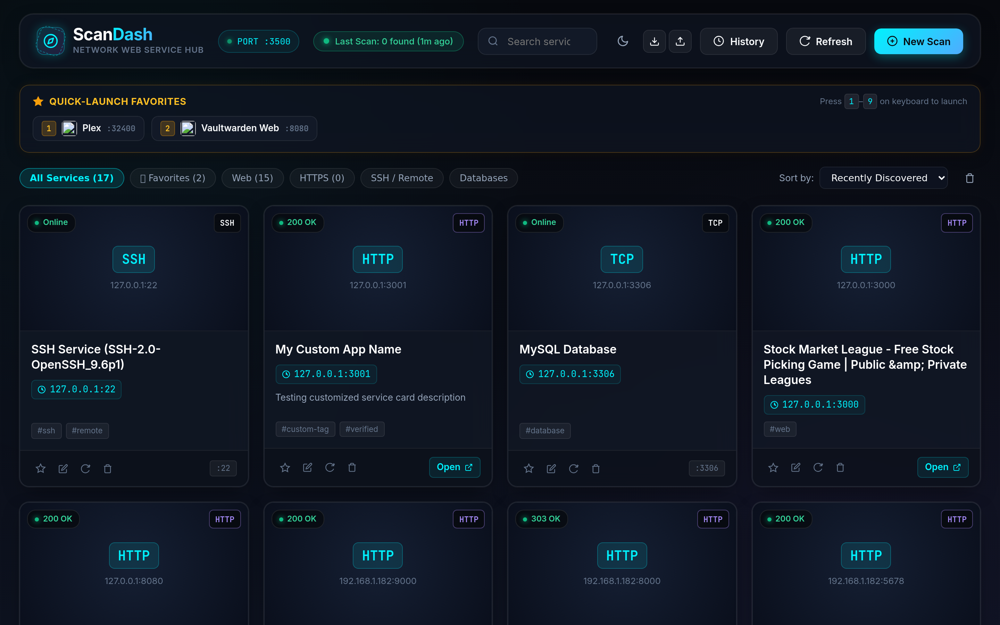

# ⚡ ScanDash

<p align="center">
  <strong>Intelligent Network Discovery & Web Service Dashboard</strong><br>
  High-speed 65,535 port scanner with automated webpage thumbnails and customizable service cards.
</p>

<p align="center">
  
  
  
  
  <a href="https://buymeacoffee.com/marcjc1173" target="_blank"></a>
</p>

<p align="center">
  
</p>

---

## ✨ Features

- ⚙️ **`.env` Configurable Port**: Run on any port specified in `.env` (`PORT=3500`, `PORT=8080`, etc.).
- 🚀 **Blazing-Fast 65,535 Port Scanner**: Custom high-throughput async TCP socket engine scanning all 65,535 ports in ~4–5 seconds per IP.
- 🎯 **Flexible Target Support**: Scan single IPs (`127.0.0.1`), hostnames, comma-separated lists, IP ranges (`192.168.1.1-50`), or CIDR subnets (`192.168.1.0/24`).
- 📸 **Automated Webpage Thumbnails**: Automatically probes discovered ports for HTTP/HTTPS web apps and takes crisp screenshot previews using headless Chromium.
- 🏷️ **Protocol & Banner Grabber**: Detects HTTP, HTTPS, SSH, FTP, MySQL, PostgreSQL, Redis, RTSP, and server headers.
- ⭐ **Quick-Launch Favorites Bar & Number Shortcuts**: Pin your most-used services with one click; press numbers `1`–`9` on your keyboard to launch them instantly.
- 💾 **JSON Backup & Restore (Export / Import)**: One-click export of your customized service cards and configuration, with seamless merge or clean-restore import.
- 🎛️ **Customizable Dashboard Cards**:
  - **One-Click Launch**: Open discovered web apps in a new tab.
  - **Rename & Tag**: Customize titles, target URLs, tag chips, and notes.
  - **Re-Probe**: Refresh individual services and retake thumbnails on demand.
  - **Delete Cards**: Remove unwanted, decommissioned, or closed services.
- 📡 **Real-Time Live HUD**: Server-Sent Events (SSE) stream live progress, speed meters (ports/sec), and newly discovered ports directly to your browser.
- 🌓 **Light & Dark Theme Switcher**: Toggle effortlessly with smooth CSS color tokens.
- 🌌 **Modern Cyber-Glassmorphism UI**: Polished interface with glowing accents, smooth transitions, and responsive layout.

---

## 🛠️ Quick Start

### 1. Clone & Install Dependencies
```bash
git equitable clone <your-repo-url> scandash
cd scandash
npm install
```

### 2. Configure Environment
Copy `.env.example` to `.env` and set your desired port:
```bash
cp .env.example .env
```

```ini
# .env
PORT=3500
SCAN_CONCURRENCY=750
SOCKET_TIMEOUT=350
SCREENSHOT_CONCURRENCY=3
HTTP_TIMEOUT=4000
DATA_DIR=./data
```

### 3. Run Locally
```bash
npm start
```
Visit **`http://localhost:3500`** in your browser.

---

## 🖥️ Running as a System Service (systemd)

To run ScanDash persistently in the background as a user service that starts automatically on boot:

1. Create `~/.config/systemd/user/scandash.service`:
```ini
[Unit]
Description=ScanDash - Network Discovery & Web Service Dashboard
After=network.target

[Service]
Type=simple
WorkingDirectory=/path/to/scandash
ExecStart=/usr/bin/node /path/to/scandash/server/index.js
Restart=always
RestartSec=5
Environment=NODE_ENV=production

[Install]
WantedBy=default.target
```

2. Enable and start the service:
```bash
systemctl --user daemon-reload
systemctl --user enable scandash.service
systemctl --user start scandash.service
```

3. Manage the service:
```bash
# Check status
systemctl --user status scandash.service

# View live logs
journalctl --user -u scandash.service -f

# Restart service
systemctl --user restart scandash.service
```

---

## 🔌 REST & SSE API

| Method | Endpoint | Description |
| :--- | :--- | :--- |
| `POST` | `/api/scan` | Initiate a port scan for target IPs/subnets |
| `GET` | `/api/scan/progress` | SSE live stream of scan progress and found ports |
| `POST` | `/api/scan/stop` | Stop / cancel active scan |
| `GET` | `/api/services` | List discovered and saved services (supports search/filter) |
| `PUT` | `/api/services/:id` | Update custom service title, tags, custom URL, and notes |
| `POST` | `/api/services/:id/favorite` | Toggle favorite / pinned status for quick launch |
| `DELETE` | `/api/services/:id` | Delete a service card and thumbnail |
| `DELETE` | `/api/services` | Clear all dashboard cards |
| `POST` | `/api/services/:id/refresh` | Re-probe a specific port and refresh thumbnail |
| `GET` | `/api/backup/export` | Export dashboard configuration & cards as JSON backup |
| `POST` | `/api/backup/import` | Import JSON backup file (merge or clean-restore mode) |
| `GET` | `/api/history` | Get recent scan history logs |
| `GET` | `/api/network-info` | Get local host IP interfaces |
| `GET` | `/api/config` | Get active server configuration |

---

## 🧪 Testing

Run the automated end-to-end verification test suite:
```bash
node test/verify_all.js
```

---

## ☕ Support / Buy Me a Coffee

If you find **ScanDash** useful and would like to support its ongoing development, consider buying me a coffee!

<p align="left">
  <a href="https://buymeacoffee.com/marcjc1173" target="_blank">
    
  </a>
</p>

---

## 📄 License

This project is open source and available under the [MIT License](LICENSE).
